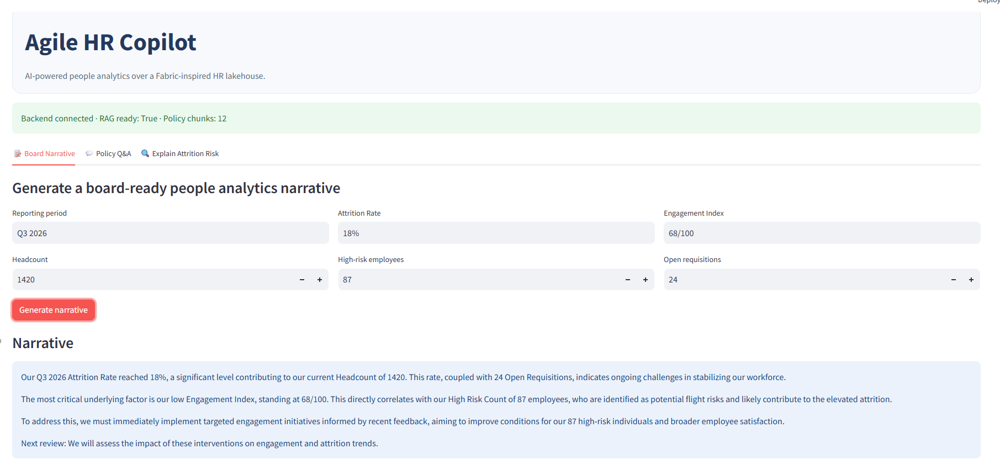
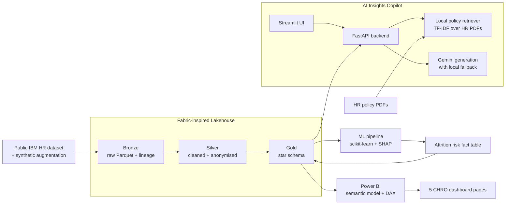
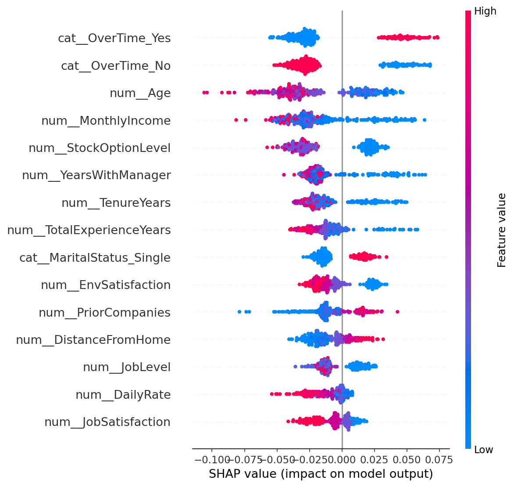
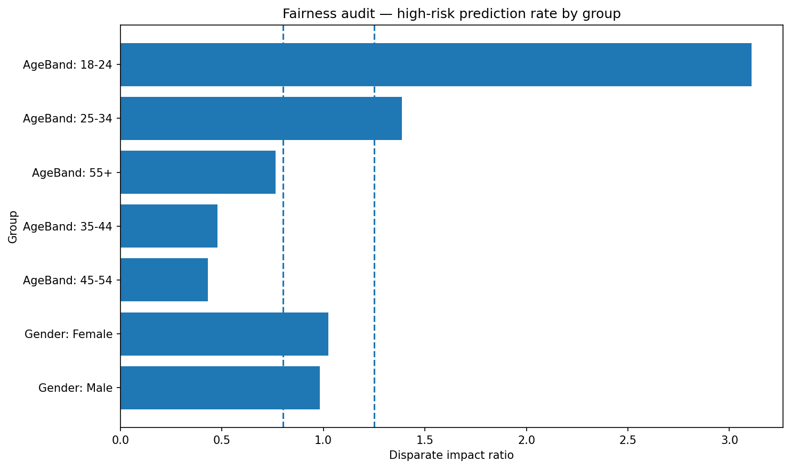

# Agile HR Copilot

> A Fabric-inspired People Analytics accelerator with AI insights.  
> End-to-end build: medallion lakehouse → attrition-risk ML → Power BI semantic model → AI Copilot.



---

## Why this project exists

Agile HR Copilot is a compact people-analytics accelerator built to show how an HR Insights solution can be delivered on a Microsoft Fabric-style architecture.

The project turns a public HR attrition dataset into a governed analytics product: bronze/silver/gold lakehouse layers, a Power BI star schema, attrition-risk modelling, SHAP explanations, and an AI Copilot that can generate executive narratives, answer HR policy questions, and explain attrition-risk drivers in plain English.

The build is intentionally governance-first. It uses public and synthetic data only, anonymised employee IDs, bucketed demographic fields, model explainability, fairness auditing, k-anonymity measures, and human-in-the-loop framing for any people-risk intervention.

---

## What it does

- **Medallion lakehouse** — Bronze, Silver, and Gold Parquet layers
- **Power BI semantic model** — star schema, relationships, and DAX measures
- **5 dashboard pages** — Executive Overview, Attrition & Retention, Employee Engagement, Diversity & Inclusion, Workforce Planning
- **Attrition-risk ML model** — Random Forest model with Logistic Regression baseline
- **SHAP explainability** — global SHAP summary and employee-level top drivers
- **AI Copilot** — board narrative generation, policy-grounded Q&A, and plain-English risk explanations
- **Governance layer** — fairness audit, k-anonymity measures, model card, anonymised IDs, audit logging

---

## Architecture

See the full architecture notes here: [`docs/architecture.md`](docs/architecture.md)



---

## Dashboard screenshots

| Executive Overview | Attrition & Retention | Employee Engagement |
|---|---|---|
|  |  |  |

| Diversity & Inclusion | Workforce Planning | AI Copilot |
|---|---|---|
|  |  |  |

---

## Key artefacts

| Area | Artefact |
|---|---|
| Lakehouse build | `scripts/day1_build_lakehouse.py` |
| Day 1 verification | `scripts/verify_day1.py` |
| ML training | `scripts/day2_train_attrition_model.py` |
| Day 2 verification | `scripts/verify_day2.py` |
| API smoke test | `scripts/smoke_day3_api.py` |
| Governance build | `scripts/day4_governance.py` |
| Model card | `docs/model_card.md` |
| Fairness audit summary | `docs/fairness_audit_summary.csv` |
| Fairness AUC by group | `docs/fairness_auc_by_group.csv` |
| Power BI report | `powerbi/AgileHRCopilot.pbix` |
| Streamlit app | `apps/web/streamlit_app.py` |
| FastAPI backend | `apps/api/app/main.py` |

---

## Lakehouse design

The project follows a medallion architecture to mirror how the same solution could be moved into Microsoft Fabric.

### Bronze

Raw IBM HR dataset ingested as Parquet with lineage metadata.

Output:

```text
lakehouse/bronze/employees_raw.parquet
```

Bronze adds:

- `_ingest_ts`
- `_source`
- `_row_hash`

### Silver

Cleaned, typed, anonymised employee table.

Output:

```text
lakehouse/silver/employees.parquet
```

Silver adds:

- Stable anonymised `EmployeeID`
- `AgeBand`
- `SalaryBand`
- `TenureCohort`
- `AttritionFlag`

### Gold

Business-ready star schema for Power BI and AI Copilot use.

Outputs:

```text
lakehouse/gold/dim_date.parquet
lakehouse/gold/dim_department.parquet
lakehouse/gold/dim_employee.parquet
lakehouse/gold/dim_jobrole.parquet
lakehouse/gold/fact_employee_snapshot.parquet
lakehouse/gold/fact_engagement_pulse.parquet
lakehouse/gold/fact_recruitment.parquet
lakehouse/gold/fact_attrition_risk.parquet
```

---

## Semantic model

The Power BI model uses a star-schema structure.

### Dimensions

- `DimEmployee`
- `DimDepartment`
- `DimJobRole`
- `DimDate`

### Facts

- `FactEmployeeSnapshot`
- `FactEngagementPulse`
- `FactRecruitment`
- `FactAttritionRisk`

### Core measures

The report includes DAX measures for:

- Headcount
- Average headcount
- Attrition count
- Attrition rate
- Attrition rate YoY
- High / medium / low risk counts
- Average risk score
- Estimated cost of attrition
- Engagement index
- Response rate
- Diversity index
- Hire rate
- Offer acceptance rate
- Average time to hire
- k-anonymity-safe demographic views

---

## Attrition-risk model

The attrition-risk model is trained from the Silver employee table and writes predictions back into the Gold layer.

Output:

```text
lakehouse/gold/fact_attrition_risk.parquet
```

Each employee receives:

- `RiskScore`
- `RiskBand`
- `TopDriver1`
- `TopDriver2`
- `TopDriver3`
- SHAP impact values for each driver

The trained artefacts are stored under:

```text
apps/api/models/
```

Key model files:

```text
attrition_rf.joblib
attrition_logit.joblib
feature_meta.joblib
shap_explainer.joblib
day2_model_metrics.json
```

The model card is available here:

[`docs/model_card.md`](docs/model_card.md)

---

## SHAP explainability

The project uses SHAP to explain both global model behaviour and individual employee-level risk drivers.

Global SHAP summary:



The employee-level risk explanations are used by the AI Copilot to translate technical model drivers into plain English.

Example framing:

> This employee’s attrition risk is HIGH. The main drivers are overtime, years since promotion, and job satisfaction. Suggested manager action: schedule a supportive stay-interview and review workload and career progression signals before taking any formal action.

---

## AI Copilot

The AI Copilot exposes three workflows.

### 1. Board Narrative

Turns KPI inputs into a concise CHRO-ready narrative.

Example input:

```json
{
  "period": "Q3 2026",
  "kpis": {
    "Headcount": 1420,
    "Attrition Rate": "18%",
    "High Risk Count": 87,
    "Engagement Index": "68/100"
  }
}
```

### 2. Policy Q&A

Answers HR policy questions using the local policy corpus.

Example question:

```text
What does our retention policy say about stay interviews?
```

The Copilot retrieves relevant policy chunks and returns the answer with source references.

### 3. Explain Attrition Risk

Explains a selected employee’s attrition-risk drivers in manager-friendly language.

The endpoint uses:

```text
lakehouse/gold/fact_attrition_risk.parquet
```

and returns:

- Employee ID
- Risk score
- Risk band
- Top drivers
- Plain-English explanation

---

## Retrieval design

The current local demo uses a lightweight TF-IDF retriever over HR policy PDFs.

This choice was made to keep the demo robust and avoid external embedding-model failures during local execution. The retriever still grounds answers in the policy corpus and returns source metadata.

A production version would replace this layer with:

- managed embeddings
- governed vector search
- access-controlled document stores
- monitoring and evaluation of retrieval quality

---

## Privacy and governance

This project is designed as a governance-first HR analytics demo.

### Data privacy

- No real employee data is used
- Public IBM HR dataset only
- Synthetic monthly snapshots
- Synthetic recruitment funnel
- Synthetic engagement pulse
- Anonymised employee IDs
- Bucketed demographics

### Dashboard governance

- k-anonymity measures for demographic views
- Aggregated diversity and inclusion reporting
- No individual-level demographic targeting
- Risk predictions framed as decision support

### Model governance

- Fairness audit across Gender, AgeBand, and Department
- Disparate impact review
- ROC-AUC by group where class balance allows
- Published model card
- Human-in-the-loop decision framing

Governance artefacts:

```text
docs/model_card.md
docs/fairness_audit_summary.csv
docs/fairness_auc_by_group.csv
docs/images/fairness_audit.png
notebooks/05_fairness_audit.ipynb
```

---

## Fairness audit

The fairness audit checks high-risk prediction rates across demographic and organisational groups.



The goal is not to claim the model is production-safe. The goal is to show the governance pattern: measure, document, review, and only then decide whether a model is appropriate for use.

In a real deployment, any significant group-level disparity would trigger a review before the model was used for HR intervention.

---

## Running locally

### 1. Clone the repository

```powershell
git clone https://github.com/AlirezaYegane/Agile_HR_Copilot.git
cd Agile_HR_Copilot
```

### 2. Create and activate the virtual environment

```powershell
py -3.11 -m venv .venv
.\.venv\Scripts\Activate.ps1
```

### 3. Install dependencies

```powershell
python -m pip install --upgrade pip setuptools wheel
pip install -r requirements.txt
```

For staged installs, use:

```powershell
pip install -r requirements-day1.txt
pip install -r requirements-day2.txt
pip install -r requirements-day3.txt
```

### 4. Create `.env`

```powershell
Copy-Item .env.example .env
notepad .env
```

Set:

```env
GOOGLE_API_KEY=YOUR_GEMINI_API_KEY_HERE
GEMINI_MODEL=gemini-2.5-flash
GOOGLE_EMBEDDING_MODEL=disabled-local-tfidf
CHROMA_PERSIST_DIR=./apps/api/chroma_db
POLICY_DOCS_DIR=./data/policies
GOLD_LAKEHOUSE_PATH=./lakehouse/gold
AUDIT_LOG_PATH=./apps/api/audit.log
```

The local retriever does not require Google embeddings. Gemini generation can fall back to local deterministic text if the model is unavailable.

---

## Rebuild the project

### Day 1 — Lakehouse

```powershell
python scripts\day1_build_lakehouse.py
python scripts\verify_day1.py
```

Expected output:

```text
DAY 1 VERIFY PASSED
bronze rows: 1,470
silver rows: 1,470
```

### Day 2 — ML and risk scores

```powershell
python scripts\day2_train_attrition_model.py
python scripts\verify_day2.py
```

Expected output:

```text
DAY 2 VERIFY PASSED
risk rows: 1,470
```

### Day 3 — FastAPI Copilot

Start the backend:

```powershell
uvicorn apps.api.app.main:app --port 8001
```

In a second terminal:

```powershell
python scripts\smoke_day3_api.py
```

Expected result:

```text
Health: 200
Narrative: 200
Ask: 200
Explain risk: 200
```

### Day 3 — Streamlit UI

With FastAPI still running:

```powershell
streamlit run apps\web\streamlit_app.py
```

Open the local Streamlit URL and test:

- Board Narrative
- Policy Q&A
- Explain Attrition Risk

---

## API endpoints

### Health

```http
GET /api/health
```

Response:

```json
{
  "status": "ok",
  "rag_ready": true,
  "policy_chunks": 12
}
```

### Narrative

```http
POST /api/narrative
```

Payload:

```json
{
  "period": "Q3 2026",
  "kpis": {
    "Headcount": 1420,
    "Attrition Rate": "18%",
    "High Risk Count": 87,
    "Engagement Index": "68/100"
  }
}
```

### Ask

```http
POST /api/ask
```

Payload:

```json
{
  "question": "What does our retention policy say about stay interviews?"
}
```

### Explain risk

```http
POST /api/explain-risk
```

Payload:

```json
{
  "employee_id": "EMP_XXXXXXXXXX"
}
```

---

## Power BI report

Power BI file:

```text
powerbi/AgileHRCopilot.pbix
```

Dashboard pages:

1. Executive Overview
2. Attrition & Retention
3. Employee Engagement
4. Diversity & Inclusion
5. Workforce Planning

The `.pbix` connects to local Gold Parquet outputs under:

```text
lakehouse/gold/
```

Because Parquet files are ignored by Git, rebuild the lakehouse locally before refreshing the Power BI report.

---

## Project structure

```text
Agile_HR_Copilot/
├── apps/
│   ├── api/
│   │   └── app/
│   │       ├── main.py
│   │       ├── narrative.py
│   │       ├── rag.py
│   │       └── explain.py
│   └── web/
│       └── streamlit_app.py
├── data/
│   ├── raw/
│   └── policies/
├── docs/
│   ├── architecture.md
│   ├── model_card.md
│   ├── fairness_audit_summary.csv
│   ├── fairness_auc_by_group.csv
│   └── images/
├── lakehouse/
│   ├── bronze/
│   ├── silver/
│   └── gold/
├── notebooks/
├── powerbi/
├── scripts/
├── README.md
├── requirements.txt
├── requirements-day1.txt
├── requirements-day2.txt
├── requirements-day3.txt
└── .env.example
```

---

## Tech stack

| Layer | Tool |
|---|---|
| Storage | Parquet + DuckDB |
| ETL | Python, pandas, pyarrow |
| ML | scikit-learn + SHAP |
| BI | Power BI Desktop + DAX |
| API | FastAPI |
| UI | Streamlit |
| LLM | Gemini, with local fallback |
| Retrieval | Local TF-IDF policy retriever |
| Governance | fairness audit, model card, k-anonymity measures |

---

## Why this mirrors Microsoft Fabric

This local implementation is intentionally shaped like a Fabric solution:

- Bronze/Silver/Gold lakehouse layers mirror OneLake/Delta patterns.
- The Gold star schema feeds the Power BI semantic model.
- ML predictions are written back as a reusable Gold fact table.
- The Copilot layer grounds executive narratives in structured KPIs and policy documents.
- Governance artefacts are kept alongside the analytics product, not added as an afterthought.

---

## Limitations

- The IBM HR dataset is small and static.
- Monthly snapshots are synthetic and used to create a time-series demo.
- Recruitment and engagement facts are synthetic.
- The model is not production-ready without real temporal validation.
- Local TF-IDF retrieval is sufficient for demo grounding but should be replaced with managed embeddings in production.
- Fairness results are diagnostic only and should not be interpreted as deployment approval.

---

## Roadmap

- Port lakehouse to Microsoft Fabric OneLake + Delta
- Replace local TF-IDF with managed embeddings and governed vector search
- Integrate Copilot outputs into Power BI or Fabric-native Copilot workflows
- Add role-level security and Microsoft Purview sensitivity labels
- Add survey free-text NLP and theme extraction
- Add automated evaluation for policy Q&A retrieval quality
- Add deployment scripts for API and UI

---

## Interview framing

One-sentence demo framing:

> I built a Fabric-inspired HR analytics accelerator that mirrors an HR Insights product: medallion lakehouse, Power BI semantic model, five CHRO dashboards, attrition-risk ML with SHAP explanations, and an AI Copilot that generates policy-grounded board narratives with governance built in from day one.

---

## License and data

This project uses the public IBM HR Analytics Attrition dataset plus synthetic augmentations.

No real employee data is used.

```text
Data: public IBM HR dataset + synthetic augmentation
Purpose: interview/demo project
```