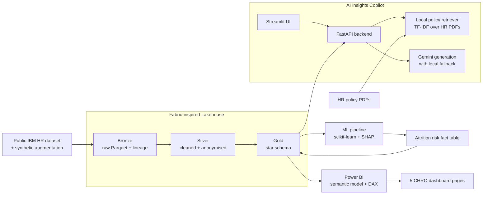

# Architecture

## Notes

This local build mirrors the shape of a Microsoft Fabric implementation:

- Bronze/Silver/Gold lakehouse layers map to OneLake/Delta patterns.
- The Gold layer feeds the Power BI semantic model.
- The ML model writes predictions back into Gold as a reusable fact table.
- The Copilot layer grounds answers in HR policy documents and people analytics KPIs.

## Generative AI fallback behaviour

The Copilot is designed to keep working even when Gemini is unavailable:

- **Narrative endpoint** — if `GOOGLE_API_KEY` is missing or Gemini fails, a deterministic local narrative is returned, with a clear fallback note.
- **Policy Q&A** — answers are grounded in TF-IDF retrieval over the HR policy PDFs. If Gemini is unavailable, the API still returns the strongest excerpt and full source list.
- **Explain risk** — falls back to a templated plain-English explanation built from the SHAP top drivers in `fact_attrition_risk.parquet`.

This makes the demo robust on a clean clone, an air-gapped laptop, or a flaky network.
